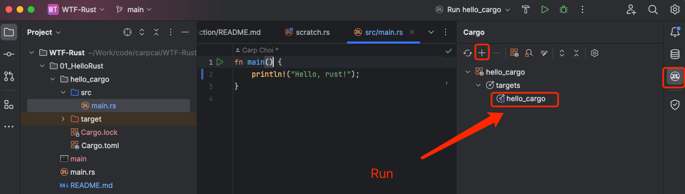

# WTF Rust 极简入门: 1. Hello Rust

我最近在重新学`Rust`，巩固一下细节，也写一个`WTF Rust极简入门`，供小白们使用（编程大佬可以另找教程），每周更新 1-3 讲。

## Rust 简介

`Rust` 是一种系统编程语言，由 Mozilla Research 开发，注重安全性、速度和并发性。它旨在帮助开发者构建可靠、高效的软件系统，同时防止常见的安全漏洞，如空指针引用、缓冲区溢出等。

`Rust`的设计理念包括零成本抽象、保证内存安全、无数据竞争的并发以及实用主义。它通过所有权`ownership`、借用`borrowing`和生命周期`lifetimes`等机制，确保内存安全，同时避免了垃圾回收带来的性能开销。

## 安装Rust

首先，我们需要在你的机器上安装`Rust`。`Rust`有一个超棒的安装工具，叫作`rustup`，它会帮助我们管理`Rust`版本和相应的工具链。让我们来装上它！

在`macOS`, `Linux`, 或者类`Unix` 操作系统上按照如下命令安装

打开你的终端（或命令行），输入以下命令：

```bash
curl --proto '=https' --tlsv1.2 -sSf https://sh.rustup.rs | sh
```

这条命令会下载一个脚本并执行，脚本会自动安装`rustup`和Rust的默认版本（包括`rustc`，Rust的编译器，和`cargo`，Rust的包管理工具）。按照终端里的指示操作，一切设置妥当后，我们就可以进入下一步啦！

如果是`Windows`系统，下载exe文件安装，链接: [rustup-init.exe](https://static.rust-lang.org/rustup/dist/i686-pc-windows-gnu/rustup-init.exe)

## Hello Rust程序

在编程语言的学习旅程中，`Hello, Rust!`程序是传统的第一步。它是最简单的程序，向世界“问好”。在Rust中也不例外，我们来试试！

1. 创建一个新文件夹，命名为`hello_rust`，然后进入这个文件夹。
2. 在`hello_rust`文件夹内，创建一个新的文件，命名为`main.rs`。文件名的`.rs`后缀代表这是一个Rust源文件。
3. 打开`main.rs`，使用你喜爱的文本编辑器，输入以下代码：

```rust
fn main() {
    println!("Hello, rust!");
}
```

简单解释一下，这段代码定义了一个函数`main`，这是每个Rust程序的入口点。当Rust程序运行时，它会执行`main`函数里的代码。`println!`是一个宏（我们以后会谈到宏），用于将文本输出到终端。

4. 保存文件，回到终端，确保你在`hello_rust`文件夹内，然后输入以下命令编译并运行你的程序：

```bash
rustc main.rs
./main
```

如果你是`Windows`用户，运行程序的命令可能稍有不同，比如直接输入`main`。

如果一切顺利，你的终端会输出：

```
Hello, rust!
```

恭喜你，你已经成功运行了你的第一个Rust程序！

## 使用Cargo

在Rust的世界里，`cargo`是你的好朋友。它不仅是个包管理工具，还能帮你构建项目、下载依赖、运行测试等等。让我们来看看如何使用`cargo`创建和运行一个新的项目。

1. 打开终端，输入以下命令创建一个新的Rust项目：

```bash
cargo new hello_cargo
```

这个命令会创建一个名为`hello_cargo`的新文件夹，里面包含一个初步的项目结构。

2. 进入`hello_cargo`文件夹，你会发现有两个主要文件：`Cargo.toml`和`src/main.rs`。`Cargo.toml`是你的项目配置文件，而`src/main.rs`则是你的主程序文件，里面已经有一段默认的`Hello, rust!`代码。

3. 让我们直接编译并运行项目，看看`Cargo`的魔法吧！在`hello_cargo`文件夹的终端内，输入以下命令：

```bash
cargo run
```

`cargo run`命令会自动编译你的代码（如果需要的话），并运行生成的程序。你应该会在终端看到`Hello, rust!`的问候。

4. 如果你使用 RustRover 可以在自带的`Cargo`插件中，直接快速运行程序，方便程序快速验证。



5. 在后续的章节中的演示代码，我将都会使用 `cargo` 进行演示，方便大家运行与测试。

就这样！现在，你已经知道了如何安装`Rust`，编写和运行`Rust`程序，并使用`Cargo`管理简单的项目。这只是冰山一角，`Rust`的世界充满了更多的可能性和探险等着你。准备好了吗？让我们继续前进，深入`Rust`的奇妙之旅吧！

## 总结

本章主要介绍了`Rust`安装方法，写了第一个`Rust`程序--`Hello rust`，并介绍了如何使用`Cargo`进行项目开发
